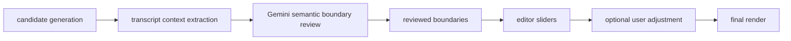
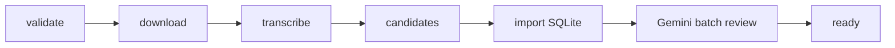

# Podcast Shorts Cutter

AI Podcast Clip Cutter is a local-first podcast automation toolkit for turning long podcast, interview, and talking-head videos into vertical short clips.

The core media processing workflow is deterministic and can be orchestrated with Airflow. A separate Clip Review Agent can send compact transcript context to Gemini for semantic temporal boundary review before a human renders final shorts.

The system does not claim viral prediction or fully automate editorial judgment. It proposes draft clips, shows why they were selected, lets the user adjust start/end boundaries, and renders final MP4 files only after review.

## Core Pipeline

```text
URL or local video
  -> download/reuse source media
  -> Faster-Whisper transcription
  -> speaker attribution / diarization
  -> podcast candidate scoring
  -> optional Gemini rerank/correction
  -> draft candidates
  -> optional Gemini transcript boundary review
  -> human review in web editor
  -> 9:16 render + burned subtitles
```

The media pipeline is not an agent. The fixed processing sequence remains deterministic:

```text
download media -> transcribe -> generate candidates -> score candidates -> prepare editor project -> render
```

The review agent is separate. Candidate generation finds and ranks possible clips. Gemini does not rank clips or inspect video frames; it only decides whether transcript-aligned start/end boundaries make the candidate coherent as a standalone short.



## Main Modules

```text
manager.py              Local CLI orchestrator
download_content.py     Downloads source media with yt-dlp
transcribe.py           Creates final_transcript.json with Faster-Whisper
content_classifier.py   Podcast-only compatibility profile writer
analyze_virals.py       Scores podcast windows and writes draft candidates
local_scoring.py        Podcast heuristics and local ranking
cutter.py               Renders 9:16 raw clips
subtitler.py            Burns subtitles into rendered clips
apps/api                FastAPI editor backend
apps/api/static         Browser review UI
apps/review_agent       Transcript boundary reviewer with Gemini and local_stub modes
orchestration/airflow   Optional Airflow DAG for deterministic pipeline orchestration
```

`analyze_virals.py` still keeps its historical filename for compatibility, but the active product direction is podcast-only.

## Setup

```powershell
python -m venv .venv
.\.venv\Scripts\activate
pip install -r requirements.txt
```

FFmpeg and FFprobe must be available in `PATH`.

Copy `.env.example` when you want a local environment template. The boundary reviewer uses:

```powershell
$env:CLIP_REVIEW_MODE = "local_stub"  # or "gemini"
$env:GEMINI_API_KEY = "..."
$env:GEMINI_MODEL = "gemini-3.5-flash"
$env:CLIP_REVIEW_CONTEXT_SECONDS = "20.0"
```

`GEMINI_API_KEY` is required only when `CLIP_REVIEW_MODE=gemini`. The app never logs or stores the key.

## Run The Local Pipeline

```powershell
python manager.py --url "https://www.youtube.com/watch?v=..." --content-type auto --ai-mode local_only --subtitle-checker-mode local_only
```

The automatic analysis still writes draft windows to:

```text
top_windows.json
metadata/cutting_logic.json
```

After the editor imports those candidates, the working source of truth becomes:

```text
data/podcast_cutter.db
```

SQLite stores projects, clips, jobs, clip evaluations, and generated artifact metadata. It preserves edited start/end times, accept/reject state, render status, scores, selection reasons, review recommendations, and output paths.

`data/projects/local/project_state.json` is now a legacy compatibility import format only. If the database is empty, the editor can import that file once. After SQLite contains project data, SQLite wins and the JSON file is not rewritten by the editor.

## Refresh Local SQLite After Running Pipeline

If the pipeline generated new `project_state.json` or `top_windows.json` files but the editor still shows stale demo clips, refresh the local SQLite database:

```powershell
python -m apps.api.tools.import_local_project --reset
```

This command only replaces SQLite project/clip/artifact/evaluation rows. It does not delete local media, transcripts, cuts, metadata, or `data/projects/local/project_state.json`.

## Run The Editor

```powershell
python -m uvicorn apps.api.main:app --reload --port 8000
```

Open:

```text
http://127.0.0.1:8000
```

The editor can:

- load draft podcast candidates,
- preview the source video,
- adjust start and end,
- accept or reject clips,
- review all clips with AI transcript-boundary review,
- render final short clips,
- persist review state in SQLite.

## Run Tests

```powershell
.\.venv\Scripts\python.exe -m unittest discover -s tests
```

Or run the local validation helper:

```powershell
.\scripts\run_tests.ps1
```

## Persistence

The default database URL is:

```text
sqlite:///data/podcast_cutter.db
```

Override it with:

```powershell
$env:PODCAST_CUTTER_DB_URL = "sqlite:///C:/path/to/podcast_cutter.db"
```

The current browser editor still uses the compatibility endpoints:

```text
GET /project
GET /clips
PATCH /clips/{clip_id}
POST /clips/{clip_id}/accept
POST /clips/{clip_id}/reject
POST /render
```

The first project-oriented API is also available:

```text
POST /projects
GET /projects
GET /projects/{project_id}
GET /projects/{project_id}/clips
GET /projects/{project_id}/status
POST /clips/{clip_id}/review
GET /clips/{clip_id}/review
POST /projects/{project_id}/clips/{clip_id}/review
POST /projects/{project_id}/review-clips
```

Compatibility endpoints use the earliest SQLite project by database id as the default local project.

## Clip Review Agent

Default mode is an explicit offline stub and does not require API keys:

```powershell
$env:CLIP_REVIEW_MODE = "local_stub"
```

Real review mode uses the official Google Gen AI SDK:

```powershell
$env:CLIP_REVIEW_MODE = "gemini"
$env:GEMINI_API_KEY = "..."
```

Gemini receives only approximately `CLIP_REVIEW_CONTEXT_SECONDS` before the candidate, transcript segments overlapping the candidate, approximately the same amount after it, and numbered start/end boundary options. It returns one of three editorial decisions: `render_ready`, `adjust_boundaries`, or `reject`, plus required non-null integer option indexes. The backend maps those indexes to segment IDs and timestamps. Backend-created `manual_review` is reserved for technical or validation failure.

Safe `render_ready` and `adjust_boundaries` decisions store `reviewed_start`/`reviewed_end`, copy those values into `edited_start`/`edited_end`, and set `boundary_source="ai_review"`. Manual slider edits later change only `edited_start`/`edited_end` and set `boundary_source="user"`. Rendering always uses edited boundaries.

Gemini does not visually crop the video. Visual 9:16 rendering remains deterministic and uses `edited_start`/`edited_end` afterward.

The browser editor has a project-level **Review all with AI** button that calls `POST /projects/{project_id}/review-clips`, reloads clips, and shows the AI-reviewed boundaries on the existing handles.

See [docs/CLIP_REVIEW_AGENT.md](docs/CLIP_REVIEW_AGENT.md).

For a codebase overview, see [docs/REPO_MAP.md](docs/REPO_MAP.md). The planned frontend migration is captured in [docs/FRONTEND_REDESIGN_PLAN.md](docs/FRONTEND_REDESIGN_PLAN.md).

## Airflow Orchestration

Airflow is optional and intentionally kept out of the main application requirements. Install it separately:

```powershell
pip install -r requirements-airflow.txt
```

The DAG lives at:

```text
orchestration/airflow/dags/podcast_pipeline_dag.py
```

It prepares reviewed candidate clips from DAG config such as:

```json
{"project_id": 1, "source_url": "https://www.youtube.com/watch?v=..."}
```

The DAG does not render all clips automatically. It imports candidates into SQLite, calls the Python batch review service directly, then the human editor decides what to render.



See [orchestration/airflow/README.md](orchestration/airflow/README.md).

## Product Direction

```text
AI suggests -> human edits -> app renders
```

This is now a podcast shorts cutter, not a general gameplay/tutorial/commentary viral cutter.

This project demonstrates production-oriented AI engineering patterns:

- deterministic pipeline orchestration,
- Gemini transcript boundary review,
- typed review state,
- SQLite persistence,
- testable FastAPI endpoints,
- optional LLM evaluation with local fallback,
- human-in-the-loop review,
- Airflow DAG orchestration.
