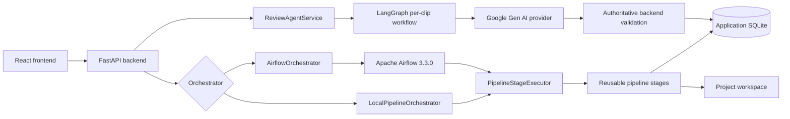
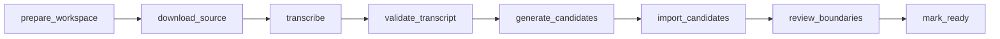
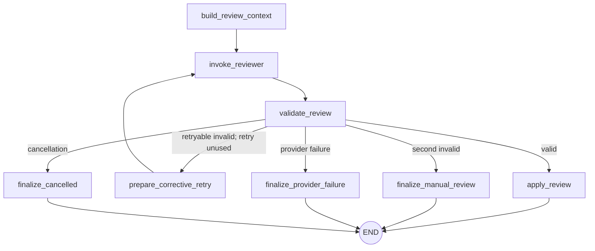

# AI Podcast Clip Cutter


An end-to-end podcast clipping platform that combines deterministic candidate
generation, Gemini semantic boundary review, LangGraph workflow routing, Apache
Airflow orchestration, FastAPI, React, and Docker.

## Current status

The core portfolio MVP is complete. `v1.0.0` is the portfolio-ready release:

- local and Airflow orchestration modes are implemented;
- the React project dashboard, processing view, clip editor, and exports view are implemented;
- LangGraph routes each semantic boundary review through validated terminal outcomes;
- final rendering remains an intentional human-triggered action;
- deployment, browser E2E tests, and automatic HTTP 429 `Retry-After` handling are optional extensions;
- Content Packaging and publishing-metadata generation are not planned.

This repository demonstrates a production-oriented architecture and validated
local Docker stack. It does not claim a production cloud deployment, guaranteed
virality, or a fully autonomous editing system.

## Demo and preview

No screenshots are committed yet, so this README intentionally contains no
placeholder or broken image links. [The demo guide](docs/DEMO.md) provides a
two-to-three-minute recording script, safe capture checklist, and recommended
asset filenames. [The portfolio overview](docs/PORTFOLIO.md) provides a concise
recruiter summary and interview talking points.

## Problem

Turning a long podcast into short clips involves more than cutting at high-score
timestamps. A useful workflow must:

1. transcribe and score candidate windows reproducibly;
2. select semantically complete openings and endings;
3. preserve user edits and provide a manual-review fallback;
4. expose processing and failures through an editor;
5. run the same domain stages locally or under an observable scheduler.

AI Podcast Clip Cutter separates those responsibilities instead of asking one
model to own the entire pipeline.

## Core capabilities

- Podcast source ingestion, Faster-Whisper transcription, transcript validation, and local candidate scoring.
- Stable project, clip, job, artifact, and review persistence in application SQLite.
- Gemini selection from backend-generated, duration-safe `allowed_boundary_pairs`.
- Authoritative backend validation before any reviewed boundary is persisted.
- LangGraph routing for success, one corrective retry, manual review, provider failure, and cancellation.
- Local subprocess orchestration or Apache Airflow 3.3.0 with LocalExecutor.
- React editor for project state, clip preview, boundary edits, accept/reject, review, rendering, and exports.
- Human-in-the-loop fallback: unresolved automatic review terminates instead of holding an Airflow task open.

## Architecture overview



Airflow uses PostgreSQL only for scheduler metadata. Application SQLite remains
the authority for product state. Local and Airflow modes call the same
`PipelineStageExecutor`, stage registry, and review service.

See [Architecture](docs/ARCHITECTURE.md), [Pipeline Services](docs/PIPELINE_SERVICES.md),
and [Engineering Decisions](docs/ENGINEERING_DECISIONS.md).

## End-to-end pipeline

```text
create project
-> prepare isolated workspace
-> download source
-> transcribe
-> validate transcript
-> generate deterministic candidates
-> import candidates into SQLite
-> optionally review boundaries through LangGraph
-> mark project ready
-> human reviews/edits
-> human triggers rendering
```

Candidate generation is deterministic and local. Gemini does not rank the full
source or invent arbitrary timestamps; it chooses the best semantic pair from
an allowlist generated from real transcript segments.

## Airflow orchestration

The optional Docker mode uses Airflow 3.3.0, PostgreSQL metadata, LocalExecutor,
a DAG processor, and the stable REST API.



Each Airflow task delegates one real stage to the shared executor. The
`review_boundaries` task has zero Airflow retries, preventing scheduler-level
Gemini retry storms. LangGraph owns the one permitted corrective provider call.

See [Airflow Operations](orchestration/airflow/README.md).

## LangGraph boundary review



Gemini performs semantic boundary selection. Backend validation remains
authoritative. A clip can make at most two provider calls: one initial call and
one corrective call for structured/domain-invalid output. Quota, timeout,
credentials, provider outage, HTTP 499, cancellation, and batch-deadline
failures do not take the corrective route.

The graph has no persistent checkpointer. Transcripts and prompts remain
ephemeral and are not placed in application events, Airflow XCom, or durable
graph state. See [LangGraph Boundary Review](docs/LANGGRAPH_REVIEW.md).

## Technology stack

| Area | Technology |
|---|---|
| Backend/API | Python 3.14, FastAPI, SQLAlchemy, Pydantic |
| Frontend | React 19, TypeScript, Vite, Tailwind CSS |
| Pipeline | Faster-Whisper, FFmpeg, yt-dlp, local transcript scoring |
| Semantic review | `google-genai`, Gemini, typed structured output |
| Workflow routing | LangGraph 1.1.10 |
| Pipeline orchestration | Local subprocess mode or Apache Airflow 3.3.0 |
| Persistence | SQLite application state; PostgreSQL Airflow metadata |
| Packaging/runtime | Docker Desktop, WSL 2 Linux containers, Docker Compose |
| Tests | Python `unittest`, Vitest, React Testing Library |

## Repository structure

```text
apps/api/                 FastAPI routes, persistence, services, orchestrators
apps/web/                 React product UI
apps/pipeline/            reusable typed stages and shared executor
apps/review_agent/        semantic boundary-review domain and provider adapter
apps/review_agent/graph/  LangGraph state, nodes, routing, and workflow
orchestration/airflow/    Airflow image, DAG, stage adapter, operations guide
tests/                    offline unit, integration, and release-smoke tests
docs/                     architecture, decisions, demo, and portfolio guides
manager.py                backwards-compatible pipeline CLI
transcribe.py             Faster-Whisper transcription entry point
```

See the detailed [Repository Map](docs/REPO_MAP.md).

## Quick start: local mode

Requirements: Windows PowerShell, Python 3.14, Node.js/npm, and FFmpeg available
to the pipeline.

```powershell
py -3.14 -m venv .venv
.\.venv\Scripts\python.exe -m pip install -r requirements.txt
Copy-Item .env.example .env
```

Keep `PIPELINE_ORCHESTRATOR=local`. The safe default
`CLIP_REVIEW_MODE=local_stub` is deterministic and intended for offline
development/testing; it is not a production fallback. Real semantic review
requires explicitly selecting `gemini` and configuring `GEMINI_API_KEY`.

Start the API on the verified development port:

```powershell
.\.venv\Scripts\python.exe -m uvicorn apps.api.main:app --reload --port 8010
```

In a second terminal:

```powershell
Set-Location .\apps\web
npm install
npm run dev
```

Vite normally opens on `http://127.0.0.1:5173`; FastAPI is
`http://127.0.0.1:8010`. The repository helper `.\scripts\dev_full_stack.ps1`
prints the same commands and can open separate windows with `-OpenWindows`.

Creating a project through React starts it through `LocalPipelineOrchestrator`.
That action can download/transcribe media, so use only a source you are
authorized to process.

## Quick start: Airflow mode

Requirements on Windows:

- Docker Desktop with the WSL 2 Linux-container backend;
- Docker Compose;
- the host FastAPI process stopped so it does not share the application SQLite file.

Create the ignored runtime environment and data directory:

```powershell
Copy-Item .\orchestration\airflow\airflow.env.example .\orchestration\airflow\.env.airflow
notepad .\orchestration\airflow\.env.airflow
New-Item -ItemType Directory -Force .\data | Out-Null
```

Replace every `change-me` value with a distinct random secret, then:

```powershell
docker compose --env-file .\orchestration\airflow\.env.airflow build
docker compose --env-file .\orchestration\airflow\.env.airflow up airflow-init
docker compose --env-file .\orchestration\airflow\.env.airflow up -d
docker compose --env-file .\orchestration\airflow\.env.airflow ps
```

| Service | Default URL |
|---|---|
| React development UI | `http://127.0.0.1:5173` |
| FastAPI in Compose | `http://127.0.0.1:8010` |
| Airflow UI/API | `http://127.0.0.1:8080` |

Normal stop preserves application data and Airflow metadata:

```powershell
docker compose --env-file .\orchestration\airflow\.env.airflow down
```

Do not add `-v` unless you intentionally want to delete Airflow metadata,
credentials, and logs. See the [Airflow guide](orchestration/airflow/README.md)
before resetting anything.

## Configuration

| Setting | Purpose | Safe example/default | Secret |
|---|---|---|---|
| `PIPELINE_ORCHESTRATOR` | Select local or Airflow orchestration | `local` | No |
| `PODCAST_CUTTER_DB_URL` | Application database URL | `sqlite:///data/podcast_cutter.db` | No |
| `PODCAST_CUTTER_PROJECT_ROOT` | Application data/workspace root | `.` | No |
| `VITE_API_BASE_URL` | Optional browser API base | `http://127.0.0.1:8010` | No |
| `APP_API_PORT` | Compose FastAPI host port | `8010` | No |
| `AIRFLOW_PORT` | Airflow host port | `8080` | No |
| `AIRFLOW_API_BASE_URL` | Backend Airflow REST URL | `http://127.0.0.1:8080` locally | No |
| `AIRFLOW_UI_BASE_URL` | Browser-facing Airflow URL | `http://127.0.0.1:8080` | No |
| `AIRFLOW_DAG_ID` | Product DAG identifier | `podcast_clip_pipeline` | No |
| `AIRFLOW_API_USERNAME` | Airflow Simple Auth user | runtime-defined | No |
| `AIRFLOW_API_PASSWORD` | Airflow REST password | unique random value | Yes |
| `AIRFLOW_JWT_SECRET` | Airflow execution JWT signing secret | unique random value | Yes |
| `CLIP_REVIEW_MODE` | `local_stub` or explicit `gemini` | `local_stub` | No |
| `GEMINI_API_KEY` | Google Gen AI credential | unset | Yes |
| `GEMINI_MODEL` | Configured review model | `gemini-3.5-flash` | No |
| `CLIP_REVIEW_CONTEXT_SECONDS` | Context before/after candidate | `20.0` | No |
| `GEMINI_REQUEST_TIMEOUT_SECONDS` | Maximum provider attempt | `300` | No |
| `GEMINI_BATCH_TIMEOUT_SECONDS` | Maximum project review batch | `1800` | No |
| `TRANSCRIPTION_DEVICE` | `auto`, `cuda`, or `cpu` | `auto` | No |
| `TRANSCRIPTION_COMPUTE_TYPE` | Faster-Whisper compute type | `auto` | No |
| `APP_DATA_HOST_PATH` | Compose application data mount | `./data` | No |
| `subtitle_checker_mode` | Per-project subtitle-check setting | `local_only` recommended offline | No |

Use `.env.example` and `orchestration/airflow/airflow.env.example` as templates.
Never commit `.env` or `.env.airflow`.

## Testing and validation

Previously verified release results:

- 257 Python tests passed.
- 40 React tests passed.
- Airflow DAG parsed with 8 tasks, zero import errors, and zero retries on `review_boundaries`.
- Mocked LangGraph smoke covered valid-first response, corrective retry, two invalid responses, HTTP 429, cancellation, and a three-clip batch.
- A real isolated Airflow smoke created one project, one job, one DagRun, executed eight sequential tasks, imported five clips, and ended with the project ready. It used `auto_review=false`, so no Gemini call occurred.

These are release-validation results, not a live CI badge. There is currently no
browser E2E suite.

Run the offline validation gate:

```powershell
.\.venv\Scripts\python.exe -m unittest discover -s tests
.\.venv\Scripts\python.exe -m pip check
Set-Location .\apps\web
npm run test -- --run
npm run lint
npm run build
Set-Location ..\..
docker compose --env-file .\orchestration\airflow\.env.airflow -f .\orchestration\airflow\docker-compose.yml config --quiet
git diff --check
```

## Engineering decisions

- Deterministic stages make candidate generation reproducible and testable.
- Gemini chooses only from backend-generated transcript boundaries.
- Backend validation, not model confidence, decides whether a result is safe to persist.
- One corrective retry balances recoverability with quota and latency control.
- LangGraph runs per clip for isolation; it does not model multiple fictional agents.
- Airflow schedules pipeline stages; it does not duplicate LangGraph nodes as tasks.
- Application SQLite and Airflow PostgreSQL have separate responsibilities.
- Local mode remains the simplest development path.

The rationale and consequences are documented in
[Engineering Decisions](docs/ENGINEERING_DECISIONS.md).

## Reliability and safety

- Runtime secrets live in ignored environment files.
- Airflow credentials stay backend-only.
- DagRun configuration is versioned and allowlisted.
- Absolute and traversal workspace paths are rejected.
- Prompts and transcripts are excluded from XCom and durable LangGraph state.
- Frontend orchestration metadata is sanitized.
- Provider failures remain distinct from product review decisions.
- Invalid/cancelled reviews do not overwrite AI boundaries, user edits, or prior valid reviewed boundaries.
- Rendering is never triggered automatically by semantic review.

These controls are engineering safeguards, not a formal security certification.

## Known limitations

- Gemini quotas may return HTTP 429; automatic `Retry-After` handling is not implemented.
- The application business database is SQLite and targets a local, single-project-at-a-time deployment.
- Airflow is validated as local Docker infrastructure, not a production cloud deployment.
- There is no browser E2E suite or automatic moderation/compliance pipeline.
- Candidate quality depends on source audio and transcription quality.
- The Airflow image intentionally excludes legacy `google-generativeai`; current provider integration uses `google-genai`.
- Final rendering remains user-triggered.

## Roadmap and completion status

The portfolio MVP is complete at `v1.0.0`. Optional extensions are limited to:

- final README/demo assets after safe screenshots are captured;
- browser E2E tests;
- deployment/production serving;
- automatic Gemini HTTP 429 `Retry-After` handling.

Content Packaging, AI titles/descriptions, hashtags, thumbnail text, publishing
metadata, additional agents, and unrelated product expansion are not part of
the roadmap.
