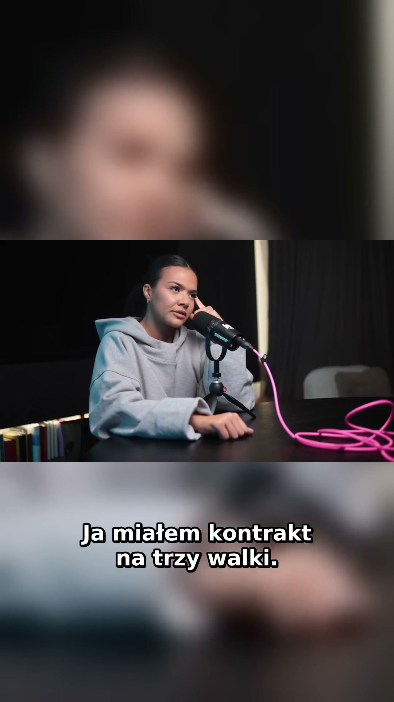
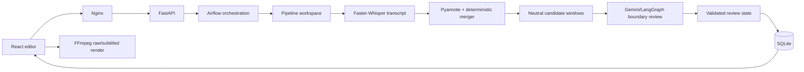

# AI Podcast Clip Cutter

AI Podcast Clip Cutter is a local-first, human-in-the-loop MVP for turning a
long podcast into reviewable 9:16 clips. It shows a recruiter the complete
product loop: deterministic media analysis, speaker-aware transcript assembly,
bounded semantic boundary review, human editing, and raw/subtitled export.

## Portfolio MVP — v1.2.0

**Portfolio MVP complete — not a production SaaS.** The product runs locally
with Docker Compose and Airflow. Candidate discovery is deliberately neutral:
replay-interest peaks create windows, but do not perform semantic scoring.
Gemini through the LangGraph boundary-review path is the only automated
semantic evaluation route; backend validation and the human editor remain
authoritative.

### Demo

[](docs/demo/portfolio-mvp-subtitled.mp4)

Selected clip: `73:56.70–75:10.88` (74.24 s), presented as a safe
`9:16 contain layout with blurred background`.

- [Watch subtitled demo](docs/demo/portfolio-mvp-subtitled.mp4)
- [Watch raw demo](docs/demo/portfolio-mvp-raw.mp4)

The local Project 5 metadata identifies the source as **“PŁACILIŚMY 80%
PROWIZJI W TEAM X - Lexy Chaplin”** and records
[`https://www.youtube.com/watch?v=iAcR3T_Q5X8`](https://www.youtube.com/watch?v=iAcR3T_Q5X8).
The local metadata does not record the channel name, and this repository has
no confirmation of redistribution rights for the external demo material.
The MIT license below applies to the code, not to third-party media.

## Verified product flow

`YouTube → Airflow → Faster-Whisper → Pyannote → deterministic merger → replay-interest candidates → Gemini/LangGraph boundary review → human edit → raw/subtitled render`

Candidate windows contain no semantic summary or heuristic quality score. The
editor builds excerpts from canonical transcript segments that overlap the
current clip bounds. Time positions use `HH:MM:SS.s`; clip durations use
`MM:SS.s`.

## Architecture


```mermaid
flowchart LR
  U[React editor] --> N[Nginx]
  N --> A[FastAPI]
  A --> O[Airflow orchestration]
  O --> W[Pipeline workspace]
  W --> T[Faster-Whisper transcript]
  T --> D[Pyannote + deterministic merger]
  D --> C[Neutral candidate windows]
  C --> G[Gemini/LangGraph boundary review]
  G --> V[Validated review state]
  V --> S[(SQLite)]
  S --> U
  U --> F[FFmpeg raw/subtitled render]
```

The canonical Docker start is:

```powershell
docker compose --env-file .\orchestration\airflow\.env.airflow up --build --detach --wait
docker compose --env-file .\orchestration\airflow\.env.airflow ps
```

Services: React/Nginx at `http://127.0.0.1:5173`, FastAPI at
`http://127.0.0.1:8010`, and Airflow at `http://127.0.0.1:8080`. Native local
mode is retained as a development/compatibility path, not the official demo.
See [docs/DEMO.md](docs/DEMO.md) and [docs/ARCHITECTURE.md](docs/ARCHITECTURE.md).

## Validation and limitations

The repository has an offline Python suite, React/Vitest tests, lint/build
checks, and Docker health checks. The verified 6 August 2026 validation for
this release includes the Airflow scheduler import, Hugging Face model-info,
`Pipeline.from_pretrained(...).to(cpu)`, healthy containers, and endpoint
smoke checks. No audio inference, full E2E, real Gemini call, or YouTube
download is claimed by this release validation.

The project is CPU-oriented, local-first, single-user, and not hosted. It does
not guarantee viral clips. Speaker labels are anonymous and are not linked to
faces. Face tracking is experimental/best-effort and is not an MVP acceptance
criterion. Subtitle styling is deterministic; it does not claim
speaker-dependent colors. There is no subtitle text editor or `Render All`.

## Production roadmap

- active-speaker/face tracking refinement;
- speaker-diarization-based subtitle colors;
- queued sequential `Render All`, progress, retry-failed, and ZIP export;
- subtitle text editor;
- hosting, auth, and multi-user persistence;
- GPU/performance optimization.

## License

Code is MIT-licensed. This license does not grant rights to external podcast
or demo media.
