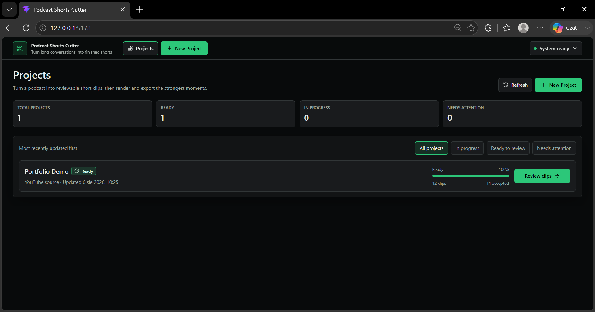
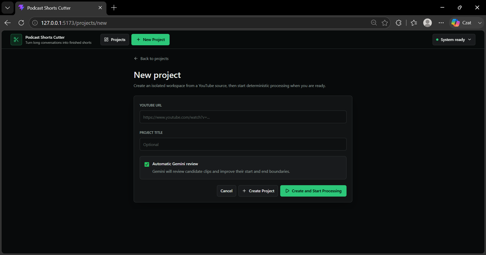
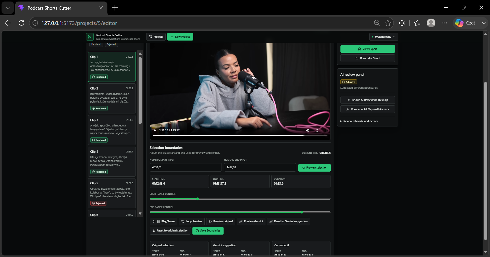
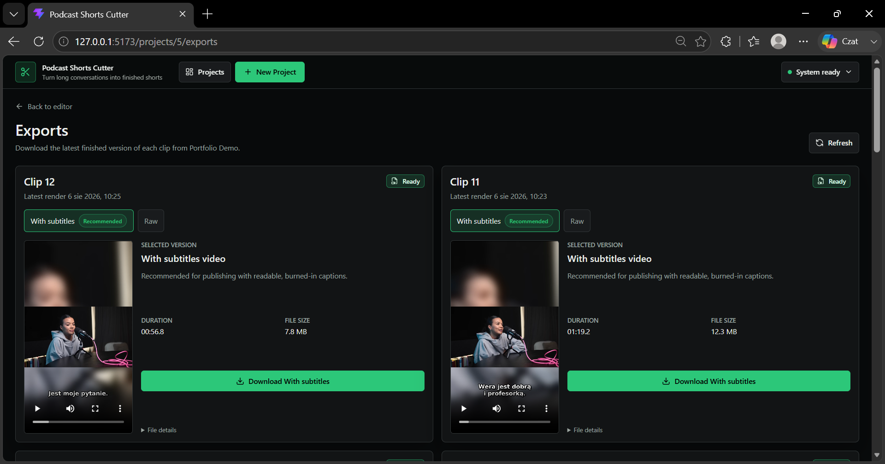
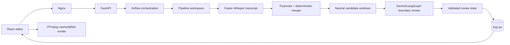

# AI Podcast Clip Cutter

AI Podcast Clip Cutter is a local-first, human-in-the-loop MVP for turning
long-form podcasts into reviewable 9:16 clips. It demonstrates the complete
product loop from deterministic candidate discovery through AI-assisted
boundary review, human editing, and raw or subtitled export.

## Portfolio MVP — v1.2.1

## Screenshot showcase

### Projects dashboard



### New project



### Review editor



### Exports



## What this project demonstrates

- local-first AI-assisted podcast clipping workflow;
- deterministic candidate discovery followed by semantic AI review;
- Gemini/LangGraph-assisted boundary refinement;
- human-in-the-loop clip review and manual editing;
- raw and subtitled vertical export generation;
- reproducible Docker Compose + Airflow setup.

## Roadmap

See the [Beyond MVP backlog](docs/BEYOND_MVP.md) for planned work outside the
current Portfolio MVP.

**Portfolio MVP complete — not a production SaaS.** The product runs locally
with Docker Compose and Airflow. Candidate discovery is deliberately neutral:
replay-interest peaks create windows, but do not perform semantic scoring.
Gemini through the LangGraph boundary-review path is the only automated
semantic evaluation route; backend validation and the human editor remain
authoritative.

### Product evidence

Full third-party source media files are not distributed with this repository.

The validated MVP produces raw and subtitled 9:16 MP4 exports from
authorized source material. Public portfolio screenshots focus on the
application interface, review workflow, orchestration status, and export
results rather than externally owned media.

## Verified product flow

`YouTube → Airflow → Faster-Whisper → Pyannote → deterministic merger → replay-interest candidates → Gemini/LangGraph boundary review → human edit → raw/subtitled render`

Candidate windows contain no semantic summary or heuristic quality score. The
editor builds excerpts from canonical transcript segments that overlap the
current clip bounds. Time positions use `HH:MM:SS.s`; clip durations use
`MM:SS.s`.

## Architecture


```mermaid
flowchart LR
  U[React editor] --> N[Nginx]
  N --> A[FastAPI]
  A --> O[Airflow orchestration]
  O --> W[Pipeline workspace]
  W --> T[Faster-Whisper transcript]
  T --> D[Pyannote + deterministic merger]
  D --> C[Neutral candidate windows]
  C --> G[Gemini/LangGraph boundary review]
  G --> V[Validated review state]
  V --> S[(SQLite)]
  S --> U
  U --> F[FFmpeg raw/subtitled render]
```

The canonical Docker start is:

First copy the example environment file and fill in the required values and
secrets:

```powershell
Copy-Item .\orchestration\airflow\airflow.env.example .\orchestration\airflow\.env.airflow
```

```powershell
docker compose --env-file .\orchestration\airflow\.env.airflow up --build --detach --wait
docker compose --env-file .\orchestration\airflow\.env.airflow ps
```

Services: React/Nginx at `http://127.0.0.1:5173`, FastAPI at
`http://127.0.0.1:8010`, and Airflow at `http://127.0.0.1:8080`. Native local
mode is retained as a development/compatibility path, not the official demo.
See [docs/DEMO.md](docs/DEMO.md) and [docs/ARCHITECTURE.md](docs/ARCHITECTURE.md).

## Validation and limitations

The repository has an offline Python suite, React/Vitest tests, lint/build
checks, and Docker health checks. The verified 6 August 2026 validation for
this release includes the Airflow scheduler import, Hugging Face model-info,
`Pipeline.from_pretrained(...).to(cpu)`, healthy containers, and endpoint
smoke checks. No audio inference, full E2E, real Gemini call, or YouTube
download is claimed by this release validation.

The project is CPU-oriented, local-first, single-user, and not hosted. It does
not guarantee viral clips. Speaker labels are anonymous and are not linked to
faces. Face tracking is experimental/best-effort and is not an MVP acceptance
criterion. Subtitle styling is deterministic; it does not claim
speaker-dependent colors. There is no subtitle text editor or `Render All`.

Users are responsible for processing only media they own or are authorized to use.

## License

Code is MIT-licensed.
