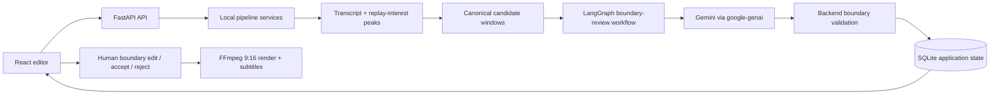

# AI Podcast Clip Cutter

AI Podcast Clip Cutter is a local-first MVP for turning a long-form podcast
into short, human-approved vertical clips. It separates deterministic candidate
discovery from semantic editorial review: replay-interest data finds moments to
inspect, while Gemini reviews only the transcript boundaries of an existing
candidate.

## User flow

1. Create a project from a source URL and run the local pipeline.
2. Download, transcribe, validate the transcript, detect replay-interest peaks,
   and generate neutral candidate windows.
3. Review each candidate's transcript boundaries with Gemini.
4. Inspect the result in the React editor, adjust boundaries when needed, then
   accept or reject the clip.
5. Render a user-selected 9:16 clip with raw and subtitled variants.

Candidate generation uses local replay-interest peaks and canonical transcript
artifacts. It does not make an editorial quality decision. Gemini is the only
product semantic-review path: it receives a compact transcript window and
selects start/end segment IDs for one of `render_ready`,
`adjust_boundaries`, or `reject`. The backend validates those IDs, ranges,
ordering, and duration before persisting anything.

If Gemini or its transport fails, the review ends as `manual_review`; existing
boundaries are preserved for a person to inspect. The review path does not
replace an unavailable provider with heuristic scoring, heuristic decisions, or
a fallback provider.

## Architecture


```mermaid
flowchart LR
  U[React editor] --> A[FastAPI API]
  A --> P[Local pipeline services]
  P --> T[Transcript + replay-interest peaks]
  T --> C[Canonical candidate windows]
  C --> R[LangGraph boundary-review workflow]
  R --> G[Gemini via google-genai]
  G --> V[Backend boundary validation]
  V --> D[(SQLite application state)]
  D --> U
  U --> E[Human boundary edit / accept / reject]
  E --> F[FFmpeg 9:16 render + subtitles]
```

The API, pipeline stages, and review service are reusable by the optional
Airflow integration, but local mode is the normal development path. Application
state is stored in SQLite; Airflow, when used, has separate scheduler metadata.

## Technology

| Area | Implementation |
| --- | --- |
| Backend | Python 3.14, FastAPI, SQLAlchemy, Pydantic |
| Review workflow | LangGraph, `google-genai`, Gemini `gemini-3.5-flash` |
| TLS on Windows | `truststore` system certificate context in each Gemini client, including spawned workers |
| Pipeline | Faster-Whisper, yt-dlp, FFmpeg, local replay-interest peak detection |
| Frontend | React 19, TypeScript, Vite, Tailwind CSS |
| Persistence | SQLite |
| Validation | Python `unittest`, Vitest, React Testing Library, GitHub Actions |

## Review and editing contract

Gemini sees no video frames, local candidate scores, database objects, API keys,
or arbitrary timestamps. It returns non-empty canonical segment IDs and a
structured decision. `recommended_action` is the persisted compatibility mirror
of the Gemini decision.

For valid Gemini decisions, review provenance is
`gemini_boundary_decision` with numeric-score provenance `not_available`.
Legacy quality/context/hook/payoff/boundary, privacy, crop, and context fields
remain `NULL` unless a historical record explicitly supplied them. They are not
used by the Gemini review flow.

The React editor remains authoritative for human-in-the-loop work. A user can
move the boundaries after review; rendering uses the edited boundaries, never
an automatic render triggered by the model.

## Run locally

Requirements: Python 3.14, [uv](https://docs.astral.sh/uv/), Node.js/npm, and
FFmpeg for media processing. Use only source media you are authorized to
process.

```powershell
Copy-Item .env.example .env
# Set GEMINI_API_KEY in .env before starting automatic semantic review.
uv sync --locked
uv run uvicorn apps.api.main:app --reload --host 127.0.0.1 --port 8010
```

In another terminal:

```powershell
Set-Location .\apps\web
npm ci
npm run dev
```

The development UI is served at `http://127.0.0.1:5173` and proxies API calls
to FastAPI at `http://127.0.0.1:8010`. Keep
`PIPELINE_ORCHESTRATOR=local` for the normal local workflow. Runtime review
configuration includes `CLIP_REVIEW_MODE=gemini`, `GEMINI_MODEL`, and the
request/batch timeout values; do not commit credentials.

## Test and validation

The CI workflow is the source of truth for the command shape. Run the relevant
offline checks locally:

```powershell
uv sync --locked
uv run python -m unittest tests.test_review_timeouts tests.test_review_agent
uv run python -m unittest discover -s tests
uv pip check

Set-Location .\apps\web
npm ci
npm run test -- --run
npm run lint
npm run build
Set-Location ..\..

git diff --check
```

## MVP limits

- A successful live Gemini decision depends on external model availability.
- The application is local-first and uses SQLite; it is not a multi-user cloud
  deployment.
- Rendering is manually initiated after editorial review.
- There is no browser end-to-end suite, automatic publishing, or automatic
  moderation/compliance workflow.
- Transcription quality depends on the input audio and Faster-Whisper output.
- Optional Docker/Airflow support is not required for normal local development.

See [Sprint 2 review](SPRINT_2_REVIEW.md) for the current acceptance-test
status and [the review-agent documentation](docs/CLIP_REVIEW_AGENT.md) for the
protocol details.
