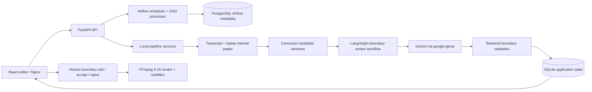

# AI Podcast Clip Cutter

AI Podcast Clip Cutter is a local-first MVP for turning a long-form podcast
into short, human-approved vertical clips. It separates deterministic candidate
discovery from semantic editorial review: replay-interest data finds moments to
inspect, while Gemini reviews only the transcript boundaries of an existing
candidate.

## User flow

1. Create a project from a source URL and run the local pipeline.
2. Download, transcribe, validate the transcript, detect replay-interest peaks,
   and generate neutral candidate windows.
3. Review each candidate's transcript boundaries with Gemini.
4. Inspect the result in the React editor, adjust boundaries when needed, then
   accept or reject the clip.
5. Render a user-selected 9:16 clip with raw and subtitled variants.

Candidate generation uses local replay-interest peaks and canonical transcript
artifacts. It does not make an editorial quality decision. Gemini is the only
product semantic-review path: it receives a compact transcript window and
selects start/end segment IDs for one of `render_ready`,
`adjust_boundaries`, or `reject`. The backend validates those IDs, ranges,
ordering, and duration before persisting anything.

If Gemini or its transport fails, the review ends as `manual_review`; existing
boundaries are preserved for a person to inspect. The review path does not
replace an unavailable provider with heuristic scoring, heuristic decisions, or
a fallback provider.

## Architecture


```mermaid
flowchart LR
  U[React editor / Nginx] --> A[FastAPI API]
  A --> O[Airflow scheduler + DAG processor]
  O --> M[(PostgreSQL Airflow metadata)]
  A --> P[Local pipeline services]
  P --> T[Transcript + replay-interest peaks]
  T --> C[Canonical candidate windows]
  C --> R[LangGraph boundary-review workflow]
  R --> G[Gemini via google-genai]
  G --> V[Backend boundary validation]
  V --> D[(SQLite application state)]
  D --> U
  U --> E[Human boundary edit / accept / reject]
  E --> F[FFmpeg 9:16 render + subtitles]
```

The Docker demo uses Airflow orchestration. Nginx serves the React SPA and
proxies `/api/*` to FastAPI, so browser routes and API routes remain separate.
FastAPI and all Airflow components share the same application `data/` mount.
Application state is stored in SQLite; Airflow has separate PostgreSQL scheduler
metadata. Native local development can still use `LocalPipelineOrchestrator`.

## Technology

| Area | Implementation |
| --- | --- |
| Backend | Python 3.14, FastAPI, SQLAlchemy, Pydantic |
| Review workflow | LangGraph, `google-genai`, Gemini `gemini-3.5-flash` |
| TLS on Windows | `truststore` system certificate context in each Gemini client, including spawned workers |
| Pipeline | Faster-Whisper, yt-dlp, FFmpeg, local replay-interest peak detection |
| Frontend | React 19, TypeScript, Vite, Tailwind CSS |
| Persistence | SQLite |
| Validation | Python `unittest`, Vitest, React Testing Library, GitHub Actions |

## Review and editing contract

Gemini sees no video frames, local candidate scores, database objects, API keys,
or arbitrary timestamps. It returns non-empty canonical segment IDs and a
structured decision. `recommended_action` is the persisted compatibility mirror
of the Gemini decision.

For valid Gemini decisions, review provenance is
`gemini_boundary_decision` with numeric-score provenance `not_available`.
Legacy quality/context/hook/payoff/boundary, privacy, crop, and context fields
remain `NULL` unless a historical record explicitly supplied them. They are not
used by the Gemini review flow.

The React editor remains authoritative for human-in-the-loop work. A user can
move the boundaries after review; rendering uses the edited boundaries, never
an automatic render triggered by the model.

## Run the Docker demo

Requirements: Docker Desktop using Linux containers, Docker Compose v2, and at
least 4 GB of memory available to Docker. No host Python, Node.js, FFmpeg, or
Airflow installation is needed. Use only source media you are authorized to
process.

```powershell
Copy-Item .\orchestration\airflow\airflow.env.example .\orchestration\airflow\.env.airflow
notepad .\orchestration\airflow\.env.airflow
```

Replace every `change-me` value. The required, local-only secrets are
`AIRFLOW_API_PASSWORD`, `AIRFLOW_DB_PASSWORD`, and `AIRFLOW_JWT_SECRET`;
`AIRFLOW_API_USERNAME` is also required. Keep the database password URL-safe.
`GEMINI_API_KEY` is optional and may remain empty. The ignored env file is not
copied into either image.

From the repository root, the canonical start command is:

```powershell
docker compose --env-file .\orchestration\airflow\.env.airflow up --build --detach --wait
```

Services and addresses:

| Service | Address | Purpose |
| --- | --- | --- |
| React/Nginx | `http://127.0.0.1:5173` | Product UI and `/api/*` reverse proxy |
| FastAPI | `http://127.0.0.1:8010` | Application API |
| Airflow | `http://127.0.0.1:8080` | DAG status and logs |
| PostgreSQL | internal only | Airflow metadata |

Check the running stack:

```powershell
docker compose --env-file .\orchestration\airflow\.env.airflow ps
Invoke-RestMethod http://127.0.0.1:5173/healthz
Invoke-RestMethod http://127.0.0.1:5173/api/health
Invoke-RestMethod http://127.0.0.1:8010/health
```

For a short offline demo, open the UI, create a project with any valid HTTPS
URL, leave automatic start disabled, and verify that it appears on the
dashboard. This exercises the real React frontend, Nginx proxy, FastAPI,
SQLite, and shared Docker workspace without downloading media or contacting an
external model. For real processing, use an authorized podcast URL.

The controlled repository smoke test uses isolated ports, data, Compose project
name, and volumes:

```powershell
.\scripts\smoke_docker.ps1
```

It builds both images, waits for every healthcheck, verifies frontend and API
access (directly and through Nginx), creates and lists one non-started project,
checks SPA routing, and confirms that Airflow lists the DAG with no import
errors. It never starts a pipeline or calls Gemini. Its `finally` cleanup
removes only the isolated smoke containers, network, volumes, and workspace.

The example config uses `CLIP_REVIEW_MODE=local_stub`, which is a deterministic
development provider for manually invoked review endpoints. The normal project
and pipeline flow works without a Gemini key when `auto_review` is disabled.
Real semantic boundary review requires `CLIP_REVIEW_MODE=gemini` and a valid
`GEMINI_API_KEY`; the Airflow automatic review task never silently falls back.

Stop the application while preserving databases, logs, and project data:

```powershell
docker compose --env-file .\orchestration\airflow\.env.airflow down
```

Do not add `--volumes` to the routine stop command.

### Windows troubleshooting

- If Docker reports a missing Linux engine pipe, start Docker Desktop and wait
  until `docker info` succeeds.
- If a port is busy, change `WEB_PORT`, `APP_API_PORT`, or `AIRFLOW_PORT` in
  `.env.airflow`.
- Keep the repository on a drive shared with Docker Desktop. WSL2-backed Linux
  containers must be enabled.
- Corporate HTTPS inspection may require the public root CA at
  `orchestration/airflow/secrets/custom-ca/root-ca.pem` and
  `CUSTOM_CA_REQUIRED=true`. Never commit that file. Docker Desktop must also
  trust the proxy for dependency downloads during image builds.
- A first build downloads the Airflow image and Python/Node dependencies and
  can take several minutes. Inspect failures with
  `docker compose --env-file .\orchestration\airflow\.env.airflow logs`.

## Native development

Native development requires Python 3.14, [uv](https://docs.astral.sh/uv/),
Node.js/npm, and FFmpeg:

```powershell
Copy-Item .env.example .env
uv sync --locked
.\scripts\dev_full_stack.ps1 -OpenWindows
```

FastAPI runs at `http://127.0.0.1:8010`; Vite prints its development URL and
proxies API calls to FastAPI. Keep `PIPELINE_ORCHESTRATOR=local` for this path.

## Test and validation

The CI workflow is the source of truth for the command shape. Run the relevant
offline checks locally:

```powershell
uv sync --locked
uv run python -m unittest tests.test_review_timeouts tests.test_review_agent
uv run python -m unittest discover -s tests
uv pip check

Set-Location .\apps\web
npm ci
npm run test -- --run
npm run lint
npm run build
Set-Location ..\..

git diff --check
```

## MVP limits

- A successful live Gemini decision depends on external model availability.
- The application is local-first and uses SQLite; it is not a multi-user cloud
  deployment.
- Rendering is manually initiated after editorial review.
- There is no browser end-to-end suite, automatic publishing, or automatic
  moderation/compliance workflow.
- Transcription quality depends on the input audio and Faster-Whisper output.
- Optional Docker/Airflow support is not required for normal local development.

See [Sprint 2 review](SPRINT_2_REVIEW.md) for the current acceptance-test
status and [the review-agent documentation](docs/CLIP_REVIEW_AGENT.md) for the
protocol details.
