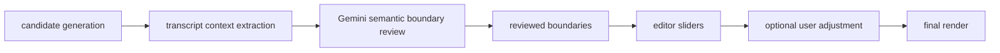

# Architecture

Podcast Shorts Cutter is a local-first, human-in-the-loop editor for podcast and talking-head material.

The pipeline proposes draft clips from a long source video. The browser editor lets a user review candidates, adjust start/end times, accept or reject clips, and render final short-form MP4 files.

The main media pipeline is deterministic. It is not an agent. The agentic component is a separate Clip Review Agent that sends compact transcript context to Gemini for semantic temporal boundary review of already-generated clip candidates.

## Pipeline Modules

`manager.py` orchestrates the CLI workflow. It prepares folders, finds or downloads media, runs transcription, builds a podcast profile, scores candidate moments, cuts clips, and applies subtitles.

`transcribe.py` creates transcript JSON from source audio using Faster-Whisper. The transcript is the main input for candidate scoring, boundary checks, and subtitles.

`content_classifier.py` is now a podcast-only compatibility module. It writes `metadata/content_profile.json` so older pipeline calls still work, but it no longer routes to gameplay, tutorial, commentary, or generic strategies.

`analyze_virals.py` keeps its historical filename for compatibility. In the current product it generates and scores podcast candidate windows. The boundary reviewer runs later and does not rank candidates.

`cutter.py` renders vertical 9:16 clips from the original input video.

`subtitler.py` burns subtitles into rendered clips.

## Pipeline Orchestration

The deterministic workflow can be orchestrated by Apache Airflow through `orchestration/airflow/dags/podcast_pipeline_dag.py`.

The DAG prepares reviewed candidate clips:

```text
validate config
-> download media
-> transcribe audio
-> generate candidates
-> import candidates to SQLite
-> review candidates with Gemini
-> mark project ready
```

Rendering remains human-triggered in the editor. The Airflow DAG does not render every candidate automatically.

Airflow is optional. It is installed from `requirements-airflow.txt` and is not required for the FastAPI app or unit tests.

## Clip Review Agent

`apps/review_agent` contains the transcript boundary reviewer.

The active workflow is:



Default mode is `local_stub`, which requires no API keys and is intended for offline development and tests. `CLIP_REVIEW_MODE=gemini` uses the official `google-genai` SDK. In Gemini mode, `GEMINI_API_KEY` is required and missing configuration fails clearly without falling back.

Gemini receives only nearby transcript segments, candidate timestamps, and allowed transcript boundary option IDs. It does not receive local scores, heatmaps, filesystem paths, database objects, full transcripts, video frames, or API keys. It does not calculate quality/privacy scores and does not return crop advice.

The Gemini structured decision is one of `render_ready`, `adjust_boundaries`, or `reject`. Safe decisions save `reviewed_start`/`reviewed_end`, copy them into `edited_start`/`edited_end`, and set `boundary_source="ai_review"`. Backend-created `manual_review` exists only for technical or validation failures.

## Editor Backend

`apps/api` exposes the local editor backend with FastAPI.

- `GET /health` confirms the API is running.
- `GET /project` returns a compatibility manifest for the current default SQLite project.
- `GET /clips` loads clips for the default SQLite project.
- `PATCH /clips/{clip_id}` saves edited start/end times.
- `POST /clips/{clip_id}/accept` marks a clip as accepted.
- `POST /clips/{clip_id}/reject` marks a clip as rejected.
- `POST /render` validates adjusted bounds, calls `cutter.py`, runs `subtitler.py` when a transcript is available, updates the clip render status, and records output files as artifacts.
- `POST /projects` creates a project record without starting the pipeline.
- `GET /projects` lists projects newest first with clip counts.
- `GET /projects/{project_id}` returns project metadata.
- `GET /projects/{project_id}/clips` returns clips for one project.
- `GET /projects/{project_id}/status` returns project processing status, clip count, and latest failed job error.
- `POST /clips/{clip_id}/review` evaluates a clip in the default project.
- `GET /clips/{clip_id}/review` returns the latest saved evaluation for a clip.
- `POST /projects/{project_id}/clips/{clip_id}/review` evaluates a clip in a specific project.
- `GET /projects/{project_id}/clips/{clip_id}/review` returns the latest saved project-specific evaluation.
- `POST /projects/{project_id}/review-clips` reviews every clip in a project through the selected provider and returns compact summary counts.

`apps/api/db` owns SQLAlchemy setup, models, and repository helpers.

`apps/api/services/project_service.py`, `clip_service.py`, `artifact_service.py`, and `legacy_import_service.py` keep routes thin and isolate persistence behavior.

`apps/api/services/project_state.py` remains as a legacy JSON compatibility helper.

`apps/api/services/clips.py` still normalizes draft windows into editor-ready clip records and validates trim ranges. Its public load/update/status/render persistence functions now delegate to SQLite-backed services.

`apps/api/services/render.py` locates local input media, prepares render folders, calls the existing render scripts, and returns output paths.

## Source Of Truth

SQLite is now the application source of truth.

The default database lives at:

```text
data/podcast_cutter.db
```

Set `PODCAST_CUTTER_DB_URL` to point at another database, for example a temporary SQLite file during tests.

The database stores:

- `projects`: source URL, title, status, and source/transcript/candidate paths.
- `clips`: stable editor IDs such as `clip_001`, AI boundaries, edited boundaries, validation bounds, accept/reject status, render status, scores, reasons, features, and latest render outputs.
- `clip_evaluations`: review provider/model metadata, semantic decision, selected option indexes, backend-derived segment IDs, reviewed boundaries, deltas from original AI boundaries, concise reasoning, warnings, context seconds, retry metadata, and legacy score/crop columns kept for compatibility.
- `jobs`: Stage 2 preparation only. The schema exists, but there is no worker, queue, polling flow, or background job system.
- `artifacts`: metadata for generated local files such as source video, transcript, candidate windows, raw clips, and subtitled clips. Video bytes are not stored in SQLite.

`project_state.json` is a legacy compatibility import format. On startup the API creates tables and runs a safe bootstrap:

```text
1. If SQLite already contains projects, use SQLite.
2. Else import data/projects/local/project_state.json if present.
3. Else import candidate windows from top_windows.json, metadata/top_windows.json, metadata/cutting_logic.json, or examples/top_windows.example.json.
4. Else leave the database empty.
```

The bootstrap does not delete or rewrite the old JSON file. Once a project exists in SQLite, old JSON and candidate files are no longer re-imported automatically.

Compatibility endpoints resolve the default local project as the earliest SQLite project by database id. Project-specific endpoints should be used when callers need a particular project.

## Product Data Flow

```text
Podcast pipeline
  -> SQLite project state
  -> Gemini semantic boundary review
  -> FastAPI
  -> current browser editor
  -> rendered artifacts
```

## Production-Oriented AI Engineering Patterns

The project demonstrates:

- deterministic pipeline orchestration,
- transcript-only Gemini boundary review,
- typed review state,
- SQLite persistence,
- testable FastAPI endpoints,
- explicit local_stub and Gemini modes,
- human-in-the-loop review,
- Airflow DAG orchestration.

It does not claim that the whole application is autonomous or multi-agent. The editor remains the final decision point before rendering.

## Removed Multi-Content Routing

The active product no longer supports separate gameplay, tutorial, commentary, or generic strategies. Those old strategy/layout files have been removed; the registry resolves to podcast behavior only.
