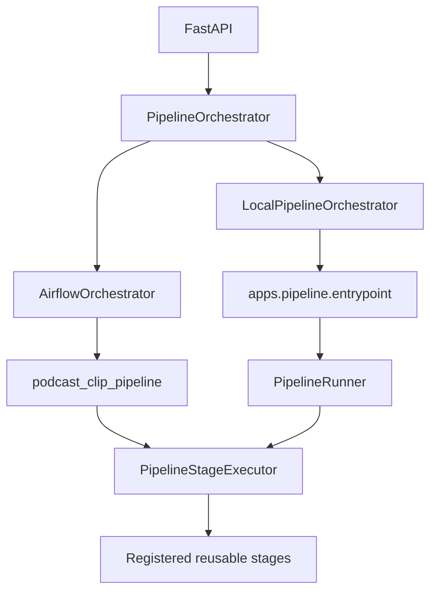
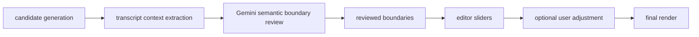

# Architecture

Podcast Shorts Cutter is a local-first, human-in-the-loop editor for podcast and talking-head material.

The pipeline proposes draft clips from a long source video. The browser editor lets a user review candidates, adjust start/end times, accept or reject clips, and render final short-form MP4 files.

The main media pipeline is deterministic. It is not an agent. The agentic component is a separate Clip Review Agent that sends compact transcript context to Gemini for semantic temporal boundary review of already-generated clip candidates.

## Pipeline Modules

`apps/pipeline` owns the deterministic workflow. `PipelineContext` carries explicit project/workspace data and safe options, stage services wrap existing algorithms, and `PipelineRunner` executes them while emitting structured lifecycle events.

`manager.py` is now a thin backwards-compatible CLI. It parses the historical flags, creates a legacy `PipelineContext`, invokes `PipelineRunner`, prints readable output, and returns an exit code. Root-level defaults, `--workspace-dir`, skip flags, transcription options, and `--analysis-only` remain compatible.

`transcribe.py` creates transcript JSON from source audio using Faster-Whisper. The transcript is the main input for candidate scoring, boundary checks, and subtitles.

Transcription device selection is controlled by `TRANSCRIPTION_DEVICE=auto|cuda|cpu` and optional `TRANSCRIPTION_COMPUTE_TYPE`. Auto mode prefers CUDA when CTranslate2 reports it, but retries once on CPU int8 when CUDA runtime libraries such as cuBLAS/cuDNN cannot be loaded. Explicit `cuda` mode fails clearly and does not fall back.

`content_classifier.py` is now a podcast-only compatibility module. It writes `metadata/content_profile.json` so older pipeline calls still work, but it no longer routes to gameplay, tutorial, commentary, or generic strategies.

`analyze_virals.py` keeps its historical filename for compatibility. In the current product it generates and scores podcast candidate windows. The boundary reviewer runs later and does not rank candidates.

`cutter.py` renders vertical 9:16 clips from the original input video.

`subtitler.py` burns subtitles into rendered clips.

## Pipeline Orchestration

FastAPI exposes local and optional Airflow Project Flow implementations through
the same `PipelineOrchestrator` protocol in `apps/api/orchestration`.

```text
create project
-> start LocalPipelineOrchestrator
-> run python -m apps.pipeline.entrypoint in a project workspace
-> PipelineRunner executes reusable stages
-> import candidates into the same SQLite project
-> optionally call ReviewAgentService directly
-> ready for editor review/render
```

`LocalPipelineOrchestrator` uses `sys.executable`, `subprocess.Popen(..., shell=False)`, a safe argument list, persisted SQLite jobs, structured event markers, and per-project logs. The subprocess boundary keeps heavy transcription/FFmpeg work and cancellation isolated from FastAPI. Rendering remains human-triggered in the editor.

The shared abstraction is:



`AirflowOrchestrator` uses authenticated Airflow 3 REST API calls and stores the
application job-to-DAG-run mapping in SQLite. DAG run configuration is versioned,
strictly allowlisted, relative-path-only, and reconstructed against the fixed
container root. PostgreSQL stores only Airflow metadata. LocalExecutor runs the
bounded stage tasks on the scheduler host.

v0.7 Airflow Orchestrator is complete and tagged
`v0.7-airflow-orchestrator`. Its real Airflow smoke test completed the DAG from
source download through candidate import and the disabled automatic-review path,
with rendering excluded as designed.

The v0.8 LangGraph Boundary Review implementation orchestrates the existing
boundary-review flow inside `ReviewAgentService`; it does not replace semantic
boundary selection with local heuristics. Each clip gets an independent,
in-memory graph invocation with one bounded corrective route. There is no graph
checkpointer or durable human interrupt: unresolved results terminate as
`manual_review`, and the application database remains authoritative. After
v0.8, only final repository/demo
hardening may remain before the project is considered complete. Optional work
is limited to browser E2E tests, deployment/production serving, and automatic
Gemini HTTP 429 `Retry-After` handling. Content Packaging and publishing
metadata generation are not part of the roadmap.

See [LANGGRAPH_REVIEW.md](LANGGRAPH_REVIEW.md) for the exact nodes and
conditional edges.

## Clip Review Agent

`apps/review_agent` contains the transcript boundary reviewer.

The active workflow is:



Default mode is `local_stub`, which requires no API keys and is intended for offline development and tests. `CLIP_REVIEW_MODE=gemini` uses the official `google-genai` SDK. In Gemini mode, `GEMINI_API_KEY` is required and missing configuration fails clearly without falling back.

Gemini calls use a configured per-attempt HTTP timeout (`GEMINI_REQUEST_TIMEOUT_SECONDS`, default 300 seconds), one SDK attempt, and a killable child-process deadline. The project batch has a separate deadline (`GEMINI_BATCH_TIMEOUT_SECONDS`, default 1800 seconds). Review emits safe per-clip events and coarse progress from 85 through 95 percent. HTTP 499 is treated as a controlled upstream-cancelled request for that clip, not success and not an infinite retry.

Gemini receives only nearby transcript segments, candidate timestamps, and numbered transcript boundary options. It does not receive local scores, heatmaps, filesystem paths, database objects, full transcripts, video frames, or API keys. It does not calculate quality/privacy scores and does not return crop advice.

The Gemini structured decision is one of `render_ready`, `adjust_boundaries`, or `reject`. Safe decisions save `reviewed_start`/`reviewed_end`, copy them into `edited_start`/`edited_end`, and set `boundary_source="ai_review"`. Backend-created `manual_review` exists only for technical or validation failures.

## Editor Backend

`apps/api` exposes the local editor backend with FastAPI.

- `GET /health` confirms the API is running and reports the selected orchestrator.
- `GET /project` returns a compatibility manifest for the current default SQLite project.
- `GET /clips` loads clips for the default SQLite project.
- `PATCH /clips/{clip_id}` saves edited start/end times.
- `POST /clips/{clip_id}/accept` marks a clip as accepted.
- `POST /clips/{clip_id}/reject` marks a clip as rejected.
- `POST /render` validates adjusted bounds, calls `cutter.py`, runs `subtitler.py` when a transcript is available, updates the clip render status, and records output files as artifacts.
- `POST /projects` creates a project record without starting the pipeline.
- `POST /projects/{project_id}/start` starts the local pipeline and returns immediately.
- `GET /projects` lists projects newest first with clip counts.
- `GET /projects/{project_id}` returns project metadata.
- `GET /projects/{project_id}/clips` returns clips for one project.
- `GET /projects/{project_id}/status` returns project processing status, clip count, and latest failed job error.
- `GET /projects/{project_id}/logs` returns a safe tail of the project pipeline log.
- `POST /projects/{project_id}/cancel` cancels a local run where practical.
- `PATCH /projects/{project_id}/clips/{clip_id}` updates project-specific edited boundaries.
- `POST /projects/{project_id}/render` renders from the project workspace while scripts still resolve from the repo root.
- `POST /clips/{clip_id}/review` evaluates a clip in the default project.
- `GET /clips/{clip_id}/review` returns the latest saved evaluation for a clip.
- `POST /projects/{project_id}/clips/{clip_id}/review` evaluates a clip in a specific project.
- `GET /projects/{project_id}/clips/{clip_id}/review` returns the latest saved project-specific evaluation.
- `POST /projects/{project_id}/review-clips` reviews every clip in a project through the selected provider and returns compact summary counts.
- `GET /projects/{project_id}/exports` returns safe project-scoped rendered artifact metadata.
- `GET /projects/{project_id}/exports/{artifact_id}/download` streams one rendered artifact after verifying it is inside the project workspace.

`apps/api/db` owns SQLAlchemy setup, models, and repository helpers. SQLite
connections enable foreign keys, WAL journaling, and a 30-second busy timeout.

`apps/api/services/project_service.py`, `clip_service.py`, `artifact_service.py`, and `legacy_import_service.py` keep routes thin and isolate persistence behavior.

`apps/api/services/project_state.py` remains as a legacy JSON compatibility helper.

`apps/api/services/clips.py` still normalizes draft windows into editor-ready clip records and validates trim ranges. Its public load/update/status/render persistence functions now delegate to SQLite-backed services.

`apps/api/services/render.py` locates local input media, prepares render folders, calls the existing render scripts, and returns output paths.

## Frontends

The legacy static editor remains in `apps/api/static` and is still served by FastAPI at `/`.

The Product UI v0.5 React app lives in `apps/web` and runs separately through Vite during validation. It uses React, TypeScript, Tailwind CSS, React Router, lucide-react, Vitest, and React Testing Library. The Vite development proxy targets `http://127.0.0.1:8010`.

The React app uses project-scoped endpoints for project, clip, review, render, source-video, log-tail, and export operations. It does not use global `GET /clips`, does not call Gemini directly from the browser, and does not display local filesystem or SQLite paths. See [REACT_FRONTEND.md](REACT_FRONTEND.md).

## Source Of Truth

SQLite is now the application source of truth.

The default database lives at:

```text
data/podcast_cutter.db
```

Set `PODCAST_CUTTER_DB_URL` to point at another database, for example a temporary SQLite file during tests.

The database stores:

- `projects`: source URL, title, status, and source/transcript/candidate paths.
- `clips`: stable editor IDs such as `clip_001`, AI boundaries, edited boundaries, validation bounds, accept/reject status, render status, scores, reasons, features, and latest render outputs.
- `clip_evaluations`: review provider/model metadata, semantic decision, selected option indexes, backend-derived segment IDs, reviewed boundaries, deltas from original AI boundaries, concise reasoning, warnings, context seconds, retry metadata, and legacy score/crop columns kept for compatibility.
- `jobs`: persisted local pipeline and optional orchestration job state, including status, stage, progress, process id, log path, errors, and exit code.
- `artifacts`: metadata for generated local files such as source video, transcript, candidate windows, raw clips, and subtitled clips. Video bytes are not stored in SQLite.

`project_state.json` is a legacy compatibility import format. On startup the API creates tables and runs a safe bootstrap:

```text
1. If SQLite already contains projects, use SQLite.
2. Else import data/projects/local/project_state.json if present.
3. Else import candidate windows from top_windows.json, metadata/top_windows.json, metadata/cutting_logic.json, or examples/top_windows.example.json.
4. Else leave the database empty.
```

The bootstrap does not delete or rewrite the old JSON file. Once a project exists in SQLite, old JSON and candidate files are no longer re-imported automatically.

Compatibility endpoints resolve the default local project as the earliest SQLite project by database id. Project-specific endpoints should be used when callers need a particular project.

## Product Data Flow

```text
Podcast pipeline
  -> SQLite project state
  -> Gemini semantic boundary review
  -> FastAPI
  -> current browser editor
  -> rendered artifacts
```

## Production-Oriented AI Engineering Patterns

The project demonstrates:

- deterministic pipeline orchestration,
- transcript-only Gemini boundary review,
- typed review state,
- SQLite persistence,
- testable FastAPI endpoints,
- explicit local_stub and Gemini modes,
- human-in-the-loop review,
- structured lifecycle events and reusable pipeline stages.

It does not claim that the whole application is autonomous or multi-agent. The editor remains the final decision point before rendering.

## Podcast-Only Compatibility Routing

The active product no longer supports separate gameplay, tutorial, commentary, or generic strategies. The `strategies/`, `layout/`, and `content_classifier.py` compatibility layers still exist because the deterministic pipeline imports them, but their registries resolve to podcast behavior only.
