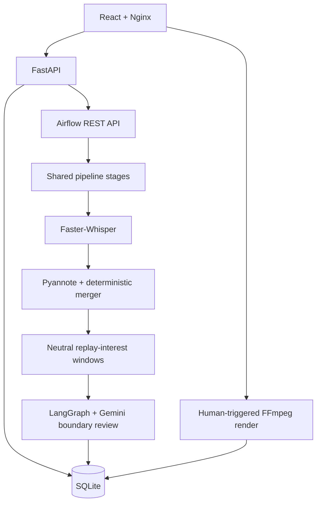

# Architecture

Release status and the public product contract live in the [root README](../README.md).

The React editor is served by Nginx and calls FastAPI. FastAPI persists
projects, clips, review provenance, and render artifacts in SQLite. Airflow
executes the shared pipeline stages in a project workspace and stores only
orchestration metadata in PostgreSQL.

```mermaid
flowchart TB
  UI[React + Nginx] --> API[FastAPI]
  API --> DB[(SQLite)]
  API --> AF[Airflow REST API]
  AF --> PIPE[Shared pipeline stages]
  PIPE --> ASR[Faster-Whisper]
  ASR --> DIA[Pyannote + deterministic merger]
  DIA --> CAND[Neutral replay-interest windows]
  CAND --> REVIEW[LangGraph + Gemini boundary review]
  REVIEW --> DB
  UI --> RENDER[Human-triggered FFmpeg render]
  RENDER --> DB
```

Candidate discovery does not semantically score clips. The review service is
the only semantic automation path; its output is bounded by canonical
transcript segment IDs and validated before persistence. Human edits remain
authoritative for rendering.
