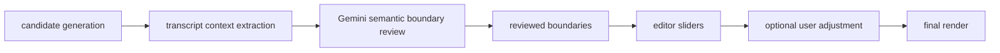
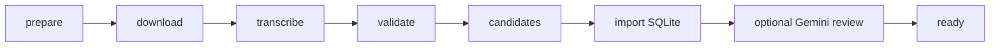

# Clip Review Agent

The Clip Review Agent performs semantic temporal boundary review for stored podcast clip candidates.

Candidate generation remains deterministic: it finds and ranks candidate windows. The review agent does not rank clips, calculate heatmap features, inspect video frames, decide visual framing, or run privacy heuristics for Gemini decisions.

## Product Flow



Gemini receives text and timestamps only:

- approximately 20 seconds of transcript before the candidate,
- transcript segments overlapping the candidate,
- approximately 20 seconds of transcript after the candidate,
- numbered allowed start and end boundary options.

The full transcript, local scores, heatmap data, filesystem paths, database objects, video frames, and API keys are not sent.

## Modes

Offline/test mode:

```powershell
$env:CLIP_REVIEW_MODE = "local_stub"
```

Real Gemini mode:

```powershell
$env:CLIP_REVIEW_MODE = "gemini"
$env:GEMINI_API_KEY = "..."
$env:GEMINI_MODEL = "gemini-3.5-flash"
$env:CLIP_REVIEW_CONTEXT_SECONDS = "20.0"
```

`GEMINI_API_KEY` is required in `gemini` mode. The service returns a clear configuration error if it is missing and never silently falls back to `local_stub`.

The implementation uses the official `google-genai==2.11.0` SDK with:

```python
from google import genai
```

Review requests use `client.interactions.create` with the current polymorphic
text/JSON `response_format`. The response adapter reads only the current
`steps` schema, accepts the `model_output` text content, and rejects the removed
legacy `outputs` schema. SDK response objects and complete provider bodies are
not persisted.

The upstream Airflow image includes the optional
`apache-airflow-providers-google` bundle, whose `google-cloud-aiplatform`
dependency requires `google-genai<2`. This application does not use that
provider. The image build removes the unused provider bundle and
`google-cloud-aiplatform`, installs the exact 2.11.0 SDK, and runs `pip check`;
Airflow core remains pinned at 3.3.0.

## Structured Decision

Gemini returns a Pydantic-validated schema:

```python
class GeminiBoundaryDecision(BaseModel):
    decision: Literal["render_ready", "adjust_boundaries", "reject"]
    selected_start_option_index: int
    selected_end_option_index: int
    reasoning_summary: str
    start_reason: str
    end_reason: str
    warnings: list[str] = []
```

Gemini does not produce numeric quality, hook, payoff, boundary, context, or privacy scores. It also does not return crop advice or defer editorial decisions to `manual_review`.

The selected option indexes are required for every Gemini response, including `reject`. For `reject`, the backend ignores the indexes and does not apply boundaries.

## Segment IDs And Timestamps

`build_clip_transcript_context(...)` assigns stable segment IDs from the normalized transcript and then exposes numbered boundary options, for example:

```json
{
  "option_index": 5,
  "segment_id": "seg_00012_76232_76844",
  "start": 762.32,
  "end": 768.44,
  "text": "Transcript text",
  "speaker": "A"
}
```

Gemini chooses `selected_start_option_index` from `start_boundary_options` and `selected_end_option_index` from `end_boundary_options`. The backend maps indexes back to segment IDs and exact timestamps:

```text
selected_start_segment_id = start option.segment_id
selected_end_segment_id = end option.segment_id
reviewed_start = start option.start
reviewed_end = end option.end
```

The backend validates that option indexes exist, start precedes end, boundaries stay inside the compact context, and the final duration fits editor limits. Invalid safe decisions get one corrective retry; if that still fails, the backend creates `manual_review` with `failed=true`.

## Boundary Lifecycle

- `ai_start` / `ai_end`: original deterministic candidate boundaries. These are never overwritten.
- `reviewed_start` / `reviewed_end`: semantic boundaries selected by Gemini or `local_stub`.
- `edited_start` / `edited_end`: current editor slider values and the render source of truth.
- `boundary_source`: `heuristic`, `ai_review`, or `user`.

For `render_ready` and `adjust_boundaries`, the backend saves reviewed boundaries, copies them into edited boundaries, and sets `boundary_source="ai_review"`.

For `reject`, the backend preserves edited boundaries and exposes rejection reasoning to the frontend. `manual_review` is an internal backend result only for technical or validation failure, such as API errors, malformed structured output, invalid segment IDs, reversed boundaries, or an invalid safe decision after one corrective retry.

Provider compatibility HTTP 400 responses, quota errors, timeouts, and
cancellation are non-retryable. Only structured/domain-invalid output may use
the single corrective retry. Compatibility failures preserve existing
boundaries and are presented separately from boundary-validation failures.

If a user later moves a slider through `PATCH /clips/{clip_id}`, only edited boundaries change and `boundary_source` becomes `user`.

## API

Standard workflow:

```text
POST /projects/{project_id}/review-clips
```

Debug/single-clip endpoints:

```text
POST /clips/{clip_id}/review
GET  /clips/{clip_id}/review
POST /projects/{project_id}/clips/{clip_id}/review
GET  /projects/{project_id}/clips/{clip_id}/review
```

Batch response shape:

```json
{
  "project_id": 1,
  "provider": "gemini",
  "model": "gemini-3.5-flash",
  "clip_count": 5,
  "success_count": 5,
  "render_ready_count": 2,
  "adjust_boundaries_count": 2,
  "reject_count": 1,
  "manual_review_count": 0,
  "failed_count": 0,
  "applied_count": 4,
  "requires_attention_count": 0,
  "summary_message": "Gemini review finished: 4 applied, 0 require attention.",
  "reviews": []
}
```

`manual_review_count` represents backend/provider failures, not an editorial Gemini choice.
The frontend uses `summary_message`, so an all-failed batch reports zero applied
and the exact number requiring attention instead of claiming a successful
Gemini review.

## Frontend

The static editor has a project-level **Review all with AI** button. It posts to the batch endpoint, shows a loading/result summary, reloads `GET /clips`, and refreshes the selected clip. Because safe AI boundaries are copied into `edited_start`/`edited_end`, the existing timeline handles immediately show the reviewed trim.

Each clip card shows latest review decision, boundary source, and whether AI changed boundaries. The selected clip shows decision, original AI bounds, reviewed bounds, edited bounds, reasoning, start reason, end reason, and warnings.

There is no standard **Apply suggestion** button. Safe Gemini decisions are already applied.

## Airflow

Airflow is an optional Dockerized product orchestrator. Its real DAG delegates
each task to the shared stage registry/executor and forces explicit Gemini mode
for automatic review; there is no provider fallback:



The review task has zero Airflow retries, preventing provider 429 responses from
creating a scheduler retry storm. An explicit project retry creates a new DAG
run and the review service skips safe completed/user-decided boundaries. Review
does not render videos; rendering remains deterministic and happens later from
`edited_start`/`edited_end`.
