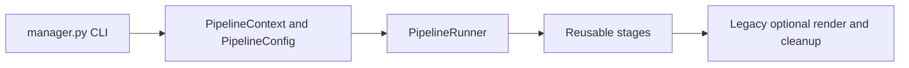
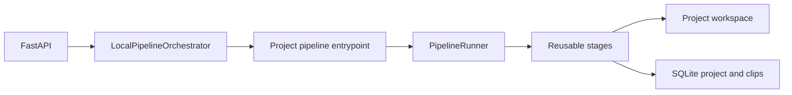
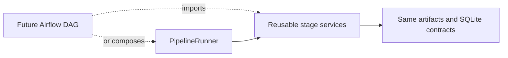

# Pipeline Services

v0.6 moves pipeline orchestration out of `manager.py` and into reusable, typed Python services under `apps/pipeline`. The refactor preserves the existing media algorithms and artifacts while giving the CLI, local product worker, and future orchestrators one implementation to call.

Apache Airflow and LangGraph are not implemented or enabled in this release.

## Architecture

`PipelineContext` contains the explicit runtime contract:

- existing `project_id` for project processing, or `None` for the legacy CLI;
- source URL;
- absolute isolated workspace;
- repository root used to resolve existing scripts/modules;
- `auto_review` and `analysis_only` switches;
- normalized `PipelineConfig` options.

Neither object contains API keys. Review and Gemini integrations resolve credentials through their existing provider configuration at call time.

`PipelineStageResult` reports the stage, success, message, workspace-relative artifacts, safe metadata, and optional controlled error category. `PipelineRunResult` collects ordered stage results and a meaningful exit code.

`PipelineEvent` emits versioned JSON markers for:

- `stage_started`;
- `stage_progress`;
- `stage_completed`;
- `stage_failed`;
- `pipeline_completed`.

Review additionally emits `review_clip_started`, `review_clip_completed`, `review_clip_manual`, and `review_clip_failed`. For five clips, terminal updates advance monotonically through 87, 89, 91, 93, and 95 percent before `ready` reaches 100.

Metadata keys that look like secrets are redacted. Progress uses only the coarse product stage map; no fractional work is invented for tools that do not expose reliable progress.

## Stage Order

The project profile runs:

```text
prepare workspace
-> download/reuse media
-> transcribe/reuse transcript
-> validate/fix transcript
-> generate deterministic candidates
-> import candidates into the existing SQLite project
-> optional configured boundary review
-> mark ready
```

The legacy CLI profile uses the same preparation, download, transcription, validation, and candidate stages. Unless `--analysis-only` is set, it then runs the existing cutter/subtitle scripts. Optional input cleanup remains last.

Stage wrappers call existing implementations such as `download_content.download_content`, `transcribe.transcribe_file`, `content_classifier`, `analyze_virals.py`, `subtitler_checker.py`, the existing candidate importer, and `ReviewAgentService`. Proven scoring, transcription, validation, rendering, and review algorithms were not rewritten.

## Legacy CLI



`manager.py` owns argument parsing, context/config construction, human-readable reporting, and the process exit code. Existing callers continue to use:

```powershell
python manager.py --url "https://www.youtube.com/watch?v=..."
```

The historical root runtime remains the default. `--workspace-dir`, `--analysis-only`, skip flags, checker settings, transcription device/model/compute options, diarization, content/layout, and cleanup remain compatible.

## Product Worker



The local orchestrator invokes:

```text
sys.executable -m apps.pipeline.entrypoint
  --project-id <id>
  --source-url <url>
  --workspace-dir <absolute workspace>
  --repository-root <absolute repository root>
  --auto-review | --no-auto-review
```

It uses `shell=False`; the URL remains one list argument. API keys are never command arguments. The project entrypoint enforces `data/projects/{project_id}/workspace`, emits structured event markers and readable technical output, persists project state, and returns `0`, `1`, `2`, or `130` for success, controlled failure, configuration/argument failure, or cancellation.

FastAPI remains responsive because heavy media work stays in a subprocess. `LocalPipelineOrchestrator` owns the job row, process id, log capture, duplicate-run guard, cancellation, cleanup, and startup recovery. Structured events update both the project and active job. Legacy human text parsing remains a fallback for historical logs, not the primary interface.

## Import And Review Safety

Candidate import targets only the supplied existing project. Stable clip ids make retry idempotent; candidate/source/transcript artifacts are replaced by type rather than duplicated. New clips initialize `edited_start`/`edited_end` from `ai_start`/`ai_end` and leave reviewed boundaries unset. Re-import updates candidate data while preserving prior reviewed or user-edited boundaries.

Automatic review is omitted when `auto_review=false`. When enabled, the stage calls `ReviewAgentService.review_project_clips()` directly and lets `ReviewConfig` select `local_stub` or Gemini. Missing Gemini configuration, provider failures, and failed review summaries produce a controlled `ReviewStageError`. The pipeline never reports Gemini merely because auto-review was requested.

`GEMINI_REQUEST_TIMEOUT_SECONDS` defaults to 300 seconds. It configures the installed `google-genai` client's millisecond HTTP timeout, explicitly limits SDK attempts, and bounds the same call in a killable child process so a blocked client cannot leave an abandoned thread. Corrective retries use the same remaining deadline. `GEMINI_BATCH_TIMEOUT_SECONDS` defaults to 1800 seconds and bounds the complete clip loop.

An individual timeout, HTTP 499, or provider failure is saved as a failed `manual_review` evaluation without changing safe clip boundaries; later clips continue. The stage fails when configuration is invalid, the batch deadline expires, all clips fail technically, or cancellation is requested. Retry skips completed AI reviews and user-decided boundaries.

Gemini free-tier quota or rate limits may return HTTP 429. The app treats this as an external provider failure, records `manual_review`, never reports Gemini success or silently switches to `local_stub`, and leaves review available for an explicit retry later. This limitation is separate from deterministic pipeline correctness.

## Failure And Retry

Controlled categories include workspace preparation, download, transcription, transcript validation, candidate generation/import, review, rendering, and cancellation errors. A failed stage:

- prevents later stages from running;
- emits `stage_failed` followed by an unsuccessful `pipeline_completed` event;
- leaves successful artifacts in place;
- persists concise project/job errors and a nonzero exit code;
- keeps the project available for explicit retry.

An explicit retry creates a new job for the same project. Downloaded media and transcripts are reused when present. Startup recovery marks orphaned work failed and never automatically restarts expensive stages.

Project retries also preserve current transcript-validation and deterministic-candidate artifacts when their source timestamps remain valid. Candidate import stays idempotent. This allows a cancelled review run to restart the same project and resume review without creating a replacement project or overwriting completed/user-reviewed boundaries.

## Future Airflow



The existing `orchestration/airflow` directory is an inactive prototype placeholder. Its importable helper functions are thin adapters over `apps.pipeline`, demonstrating the future import boundary without adding Airflow to the active application or test dependencies. A future implementation must provide orchestration-specific scheduling/retry policy without copying stage business logic.

LangGraph is also not part of v0.6. The boundary reviewer remains the existing direct typed service.
