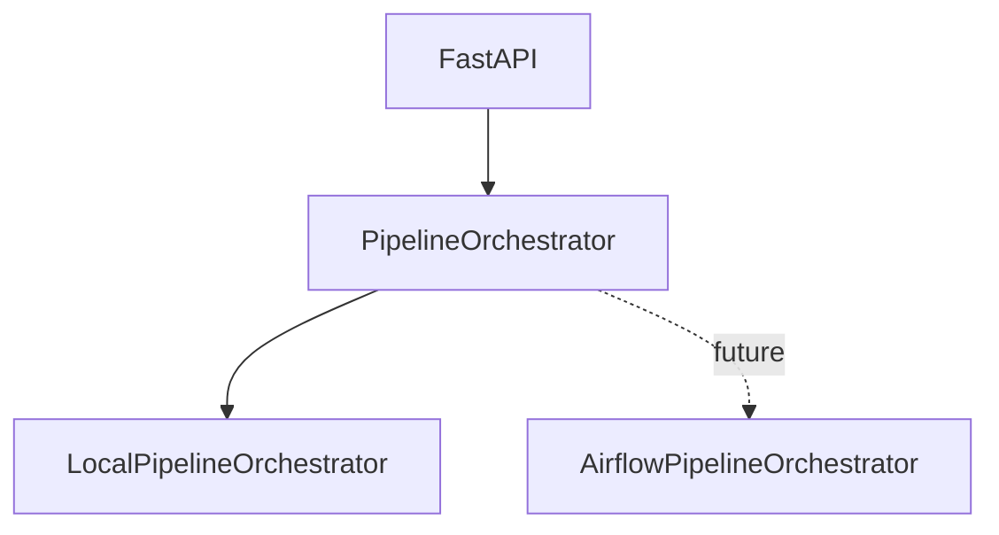

# Project Flow V1

Project Flow V1 lets the FastAPI app create and process a podcast project without the user manually running `manager.py`, importing SQLite, or calling Gemini review endpoints from PowerShell.

The first implementation uses a local orchestrator. Airflow is not installed or used by this flow, and LangGraph is not part of it.

## User Flow

```text
Create project with YouTube URL
-> Start processing
-> LocalPipelineOrchestrator runs manager.py
-> Candidate clips are imported into SQLite
-> Gemini batch boundary review runs when enabled
-> Project becomes ready
-> Existing editor opens the project clips
```

The editor still renders final MP4 clips only after a human chooses and adjusts clip boundaries.

## Current Architecture


`PipelineOrchestrator` is the API-facing abstraction. `LocalPipelineOrchestrator` is the only implementation today.



## Local Orchestrator

`apps/api/orchestration/local.py` starts `manager.py` with:

```text
sys.executable manager.py --url <source_url> --workspace-dir <workspace> --analysis-only
```

The subprocess call uses `shell=False` and passes the user URL as a single argument. It captures stdout/stderr, writes a per-project log, and stores project/job status in SQLite so FastAPI is not the only source of truth.

The manager inherits transcription configuration from the environment. `TRANSCRIPTION_DEVICE=auto` prefers CUDA but falls back once to CPU int8 when CUDA runtime libraries are missing. The warning is written to the project pipeline log and the project can continue normally.

The orchestrator maps manager output to coarse product stages:

```text
waiting: 0
downloading: 10
transcribing: 30
validating_transcript: 45
generating_candidates: 60
importing_candidates: 75
reviewing_with_ai: 85
ready: 100
```

Raw technical logs remain separate from the product status.

## Project Workspaces

Every project receives an isolated runtime workspace:

```text
data/projects/{project_id}/workspace/
  input/
  metadata/
  transcripts/
  cuts/raw/
  cuts/subtitles/
  outputs/
  logs/
  top_windows.json
```

This prevents one project from overwriting another project's downloads, transcripts, candidate windows, or render outputs.

`manager.py` remains available for debugging. Without `--workspace-dir`, it keeps the original root-level runtime behavior. With `--workspace-dir`, runtime files go into the workspace while source scripts still resolve from the repository root.

`--analysis-only` stops the initial pipeline after candidate generation so the app can import candidates and run AI boundary review before any final render work.

## API Endpoints

- `POST /projects`: creates a project and workspace. It does not start processing unless `auto_start=true` is supplied.
- `POST /projects/{project_id}/start`: starts the local pipeline and returns immediately.
- `GET /projects/{project_id}/status`: returns compact project status, stage, progress, message, and error.
- `GET /projects/{project_id}/logs?tail=200`: returns a safe log tail from the project's pipeline log.
- `POST /projects/{project_id}/cancel`: cancels an active local run where practical.
- `GET /projects/{project_id}/clips`: opens imported clips for the existing editor.
- `PATCH /projects/{project_id}/clips/{clip_id}` and accept/reject routes: keep manual editing project-specific.
- `POST /projects/{project_id}/render`: renders from that project's workspace.

The older compatibility endpoints still exist for the default local project.

## Import And Review

After `manager.py` writes `top_windows.json` in the workspace, the orchestrator imports that exact file into the existing project row. It does not create a duplicate project. Re-running import updates existing clip IDs instead of duplicating them.

When `project.auto_review` is true, the orchestrator calls `ReviewAgentService.review_project_clips()` directly. It does not make a localhost HTTP request. `CLIP_REVIEW_MODE=gemini` still requires `GEMINI_API_KEY`; missing configuration fails clearly instead of silently claiming Gemini was used.

When `auto_review` is false, the project stops after candidate import and is marked ready for manual review in the existing editor.

## Recovery

On FastAPI startup, queued or running local pipeline jobs that no longer have an active in-process worker are marked failed with an interruption message. The app preserves logs and workspace files and does not automatically restart expensive jobs.
