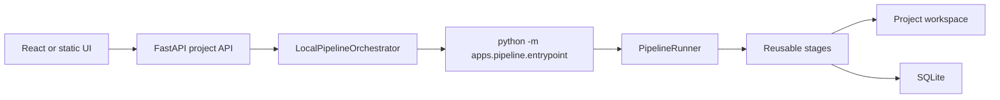

# Project Flow

The FastAPI project flow creates and processes a podcast without asking the user to run the CLI, import candidates, or call review endpoints manually. SQLite remains the source of truth and final rendering remains human-triggered.

Apache Airflow and LangGraph are not part of this release.

## User Flow

```text
Create project with source URL
-> Start processing
-> LocalPipelineOrchestrator starts the dedicated project entrypoint
-> PipelineRunner executes reusable stages in the project workspace
-> Candidates are imported into the same SQLite project
-> Optional configured boundary review runs
-> Project becomes ready
-> Editor opens project-scoped clips
```

## Local Worker Boundary



The orchestrator uses `sys.executable`, `shell=False`, and a list of arguments. The source URL is one argument and the project workspace is an explicit absolute path. The command contains no API keys. Standard output and error are captured into `data/projects/{project_id}/workspace/logs/pipeline.log`.

The subprocess emits exact `@@PIPELINE_EVENT@@` JSON markers for stage start, progress, completion, failure, and pipeline completion. The orchestrator uses those markers to update project and job state. Historical human-log inference remains only as a fallback for old logs.

## Product Stages

| Stage | Progress | Meaning |
| --- | ---: | --- |
| `waiting` | 0 | Workspace preparation |
| `downloading` | 10 | Download or reuse source media |
| `transcribing` | 30 | Create or reuse transcript |
| `validating_transcript` | 45 | Validate/fix transcript when enabled |
| `generating_candidates` | 60 | Profile and score deterministic candidates |
| `importing_candidates` | 75 | Idempotent import into the existing project |
| `reviewing_with_ai` | 85-95 | Direct configured boundary review when enabled; completed clips advance coarse progress |
| `ready` | 100 | Ready for human review |

Failed and cancelled runs preserve their last completed progress instead of inventing completion. Their product stage becomes `failed` or `cancelled`.

## Workspace Isolation

Every project must use exactly:

```text
data/projects/{project_id}/workspace/
  input/
  metadata/
  transcripts/
  cuts/raw/
  cuts/subtitles/
  outputs/
  logs/
  top_windows.json
```

`PipelineContext` rejects a project context pointed at another path. Stage services resolve scripts from the repository root and runtime artifacts from the workspace, so the workspace does not need to contain source code.

## Import And Review

`ImportCandidatesStage` calls the existing importer with the selected `project_id`. It updates clips by stable external id, does not create another project, does not duplicate artifacts on retry, preserves `ai_start`/`ai_end`, initializes edited boundaries from those AI boundaries, and does not erase prior reviewed/user boundaries during retry.

When `auto_review=true`, `ReviewCandidatesStage` constructs the existing `ReviewAgentService` directly. `ReviewConfig` remains authoritative for provider/model/key resolution. A provider/configuration exception becomes a controlled `ReviewStageError`; individual failed review results remain persisted as `manual_review` and cause a controlled pipeline failure rather than claiming Gemini succeeded. No stage renders clips automatically.

When `auto_review=false`, the review stage is omitted and the imported project becomes ready for human review.

Each provider attempt is bounded by `GEMINI_REQUEST_TIMEOUT_SECONDS` (default 300), including a corrective structured-output retry. The whole batch is bounded by `GEMINI_BATCH_TIMEOUT_SECONDS` (default 1800). For five clips, completed-clip progress is 87, 89, 91, 93, and 95. Events contain clip id/index/total/provider/decision/retry status only; prompts, transcript context, credentials, and arbitrary environment values are excluded.

A single provider timeout or HTTP 499 result is persisted as a failed `manual_review` evaluation and later clips continue. The stage fails for invalid configuration, batch deadline exhaustion, explicit cancellation, or when every clip fails technically. A partial technical failure can still reach ready so the affected clip remains available for human review.

## Failure, Retry, And Recovery

A stage failure stops all dependent stages, emits a safe structured failure, returns a nonzero entrypoint exit code, and persists failed project/job state. Product error messages are concise; technical logs retain underlying command output. Successful files are not deleted solely because a later stage failed.

Retry is explicit through another project start. Existing source media and transcripts are reused, candidate import is idempotent, and a new job row is created for the same project. FastAPI startup marks orphaned queued/running jobs failed and never automatically reruns expensive work.

Cancellation terminates the isolated process tree where supported, marks project/job state cancelled, and preserves the workspace and logs.

During review, cancellation is checked before and after each clip, before corrective retry, before evaluation persistence, and before readiness. The worker first receives a graceful cancellation signal and is force-terminated as a process tree if it does not exit promptly. Cancelled SQLite state rejects late progress or ready updates.

## CLI Compatibility

`manager.py` remains a separate legacy entrypoint. Without `--workspace-dir`, it uses the historical repository-root runtime directories. `--workspace-dir`, `--analysis-only`, all skip flags, subtitle-checker modes, transcription settings, diarization settings, content/layout settings, and cleanup remain available. It now delegates to the same runner and stage services used by project processing.
