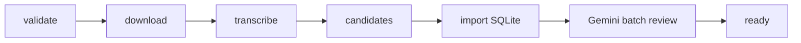

# Airflow Orchestration

Airflow orchestrates the deterministic podcast pipeline. It is not the Clip Review Agent, and it does not turn the media pipeline into an agentic system.

The DAG prepares reviewed candidate clips for the editor. Rendering remains human-triggered.

## Install

Airflow is optional and intentionally separated from the main app requirements:

```powershell
pip install -r requirements-airflow.txt
```

For a dedicated Airflow environment, set:

```powershell
$env:PODCAST_CUTTER_PROJECT_ROOT = "D:\PythonProjects\AI-Podcast-Clip-Cutter"
$env:PODCAST_CUTTER_DB_URL = "sqlite:///D:/PythonProjects/AI-Podcast-Clip-Cutter/data/podcast_cutter.db"
```

## DAG

```text
orchestration/airflow/dags/podcast_pipeline_dag.py
```

DAG id:

```text
podcast_deterministic_pipeline
```

Tasks:

```text
validate_project_config
-> download_media
-> transcribe_audio
-> generate_candidates
-> import_candidates_to_sqlite
-> review_candidates_with_gemini
-> mark_project_ready
```

The task functions live in `orchestration/airflow/pipeline_tasks.py` so they can be imported without Airflow installed.



## Trigger Config

Example DAG config:

```json
{
  "project_id": 1,
  "source_url": "https://www.youtube.com/watch?v=...",
  "clip_review_mode": "gemini"
}
```

If `project_id` is omitted, `source_url` is required and the validation task creates a new SQLite project.

`clip_review_mode` defaults to `gemini`. Set `GEMINI_API_KEY` in the Airflow environment before running real review. For offline DAG smoke tests, set `clip_review_mode` to `local_stub`.

The review task calls `ReviewAgentService.review_project_clips(...)` directly in Python. It does not require a manually running localhost FastAPI server.

## Status Updates

Tasks update the SQLite project status where practical:

```text
queued
processing
transcribing
analyzing
reviewing
ready
failed
```

Failures are recorded as failed jobs, and the API exposes the latest failure through:

```text
GET /projects/{project_id}/status
```

## Non-Goals

This stage does not add:

- browser-triggered Airflow runs,
- render-all automation,
- video rendering inside the Gemini review task,
- Docker or Kubernetes,
- cloud deployment,
- authentication.

The immediate goal is local Airflow orchestration from the Airflow UI or API with DAG config.
